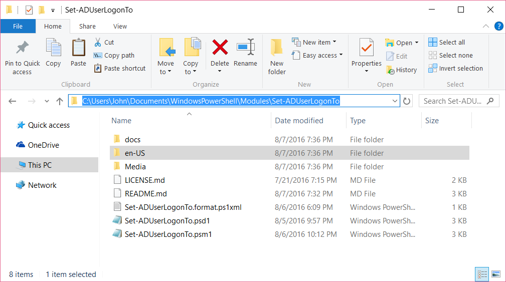
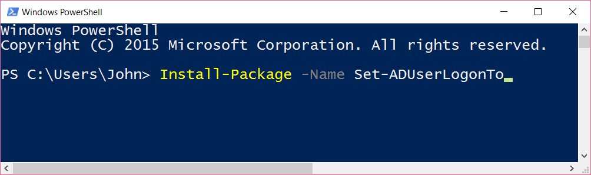

# Set-ADUserLogonTo
A PowerShell module designed to provide enhanced functionality around the querying and manipulation of userWorkstations attribute on AD users.

### Motivation
This module was created to provide some advanced functionality around the setting of the userWorkstations attribute on ADUsers. The functions included are:

* Get-ADUserLogonTo
  * Returns either which computers a user is restricted to logging into, or how many computers a user is restricted to logging into.
* Set-ADUserLogonTo
  * Sets which computers a user is restricted to logging into, or clears out existing restrictions. Has wildcard support on the ComputerList parameter.

### Prerequisites

In order to run this module, you'll need to have the **Active Directory Module** component of the **Remote Server Administration Tools** installed, as the module is reliant on the `Get-ADUser`, `Set-ADUser`, and `Get-ADComputer` functions that RSAT provides(If you're running this directly on a domain controller that's **Server 2008 R2** or later, you can probably skip this part, as the PowerShell functions will come baked in). This module was developed on **Windows 10** using **PowerShell 5** and a **Server 2012 R2 Domain**. It may work just fine with earlier versions of these platforms, but bear in mind those scenarios are untested.

###### Remote Server Administration Tools
https://support.microsoft.com/en-us/kb/2693643

### Installing

In order to install this module, just copy the module folder `Set-ADUserLogonTo` (in order for the module to be imported it's contents must be in this folder) to one the folders in `$env:PSModulePath`.
Here's an example of what it should look like:

If you have PowerShell 5, you can also install it directly from the PowerShell Gallery.

### Updating Help
The help in this module is maintained with [platyPS](https://github.com/PowerShell/platyPS), which is a powershell module that lets you generate external powershell help files from easily maintained markdown file(s). In order to update the help in this module, simply edit the markdown file for the function in `.\docs` in the module's root directory, afterwards running `New-ExternalHelp .\docs -OutputPath en-US\ -Force`. This command will update the external help file for the module, `.\en-US\Set-ADUserLogonTo-help.xml`.

### Authors

* **John Foret** - *Initial work* - [JohnForet](https://github.com/JohnForet)

### License

This project is licensed under the MIT License - see the [LICENSE.md](LICENSE.md) file for details
